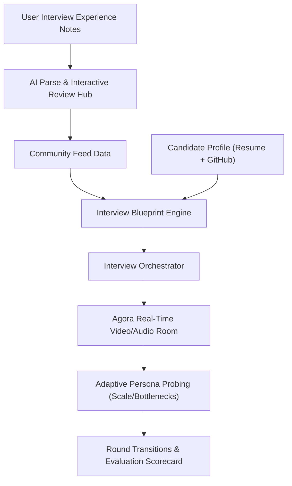

# Walkthrough - Realistic AI Interview Simulator + Interview Feed

We have built an end-to-end **Realistic AI Interview Simulator** and **Community Interview Feed** on top of your Turborepo workspace using Next.js, Express, Prisma 8, and Agora RTC Web SDK.

---

## 1. Core Architecture & Key Accomplishments



### A. Agora Real-Time Video Interview Room
- Integrated **Agora RTC Web SDK (`agora-rtc-sdk-ng`)** and server-side **Agora Token Generator** (`agora-token`).
- Built a modern **Google Meet / Zoom-style video interview software interface**:
  - Live candidate video preview with camera/microphone publication controls.
  - Prominent AI Interviewer avatar tile with animated speaking/listening waveforms.
  - Support for **Multi-Interviewer Panel tiles** during Panel rounds.
  - Top Bar: Company, Target Role, Round Title, Timer, and Agora Connection Badge.
  - Bottom Toolbar: Mic Mute/Unmute, Camera On/Off, Audio Mute, Live Transcript Drawer, and Leave Interview.

### B. Interview Orchestrator & Multi-Round Personas
- Constructs dynamic company-specific interview blueprints (Recruiter, Technical, Panel, Hiring Manager, Coding rounds).
- Generates interviewer personas with distinct names, roles, avatar images, personalities, styles, and focus areas.
- **Adaptive Natural Conversation**: Doesn't iterate through static questions; responds adaptively to candidate claims (e.g. probing system scale, deadlock prevention, bottleneck bottlenecks, and trade-off decisions).

### C. Community Interview Feed & AI Contribution Pipeline
- Social-style feed to browse real interview loops contributed by candidate engineers.
- Filter and search by company name, target role, topic, and difficulty.
- **AI Contribution Pipeline**:
  1. Candidate inputs raw story/notes.
  2. AI parses raw text into structured rounds, questions, topics, difficulty, and evaluation areas.
  3. Interactive Review & Edit interface allowing candidate to verify extracted data before publishing.
  4. One-click publishing to the community dataset.
- **Flywheel integration**: "Practice This Loop" button on feed items instantly pre-fills the Interview Simulator!

### D. Redesigned High-Impact Homepage
- Built using **shadcn/ui** and **Aceternity UI Sparkles Core**.
- Hero headline: *"Practice the interview you're actually preparing for."*
- Company & Role Search bar with instant preset buttons.
- Interactive Google Meet-style simulation preview card with live waveform indicator.
- Bento-style feature showcase highlighting Agora RTC integration, persona switching, adaptive follow-ups, and community flywheel.
- Clear 4-step "How It Works" visual breakdown and CTA banner.

### E. Detailed Post-Interview Scorecard
- Multi-dimensional scoring: Overall Score & Pass/Fail recommendation.
- Metric gauges for Technical Ability, Problem Solving, Communication, Behavioral, and Role-Specific Skills.
- Strengths and Weaknesses analysis.
- Struggled questions & suggested ideal answers.
- Panel interviewer feedback notes and verdict.

---

## 2. Updated Project Files

### Database & Express Backend (`apps/api`)
- [contract.prisma](file:///e:/Projects/Malevolent/apps/api/src/prisma/contract.prisma): Extended data contract with `InterviewExperience`, `InterviewSession`, and `ContributionDraft` models.
- [seedFeed.ts](file:///e:/Projects/Malevolent/apps/api/src/data/seedFeed.ts): Seed dataset for community interview experiences (Stripe, Google, OpenAI).
- [agoraService.ts](file:///e:/Projects/Malevolent/apps/api/src/services/agoraService.ts): Agora RTC token generator service.
- [orchestrator.ts](file:///e:/Projects/Malevolent/apps/api/src/services/orchestrator.ts): Interview Orchestrator for blueprint generation, adaptive conversation, and evaluation scorecards.
- [app.ts](file:///e:/Projects/Malevolent/apps/api/src/app.ts) & [index.ts](file:///e:/Projects/Malevolent/apps/api/src/index.ts): Express REST API server running on `http://localhost:5000`.

### Next.js Frontend (`apps/frontend`)
- [lib/api.ts](file:///e:/Projects/Malevolent/apps/frontend/lib/api.ts): API client wrapper for Express backend communication.
- [components/Navbar.tsx](file:///e:/Projects/Malevolent/apps/frontend/components/Navbar.tsx): Updated navbar with navigation links and CTA buttons.
- [app/page.tsx](file:///e:/Projects/Malevolent/apps/frontend/app/page.tsx): High-impact homepage with Aceternity Sparkles and Bento Grid.
- [app/simulator/page.tsx](file:///e:/Projects/Malevolent/apps/frontend/app/simulator/page.tsx): Candidate setup form and interview blueprint previewer.
- [app/interview/[id]/page.tsx](file:///e:/Projects/Malevolent/apps/frontend/app/interview/[id]/page.tsx): Live Agora video/audio interview room.
- [app/interview/[id]/report/page.tsx](file:///e:/Projects/Malevolent/apps/frontend/app/interview/[id]/report/page.tsx): Comprehensive scorecard report page.
- [app/feed/page.tsx](file:///e:/Projects/Malevolent/apps/frontend/app/feed/page.tsx): Community interview feed with search and topic filters.
- [app/feed/contribute/page.tsx](file:///e:/Projects/Malevolent/apps/frontend/app/feed/contribute/page.tsx): AI contribution parsing and interactive review hub.

---

## 3. How to Run & Verify

1. **Express Backend API** (running on port `5000`):
   ```bash
   cd apps/api
   npm run dev
   ```
   Health check: `http://localhost:5000/api/health`

2. **Next.js Frontend** (running on port `3000`):
   ```bash
   cd apps/frontend
   npm run dev
   ```
   Visit `http://localhost:3000` in your browser.

3. **End-to-End User Flow**:
   - Browse the **Community Feed** (`http://localhost:3000/feed`) and click **"Practice This Loop"**.
   - Fill out your resume/GitHub info in the **Simulator Setup** (`http://localhost:3000/simulator`) and click **"Construct Interview Blueprint"**.
   - Launch the **Agora Live Video Room** (`http://localhost:3000/interview/[id]`), test mic/camera controls, answer interviewer questions, and observe adaptive follow-ups.
   - Click **"Leave Interview"** to review your **Post-Interview Scorecard** (`http://localhost:3000/interview/[id]/report`).
